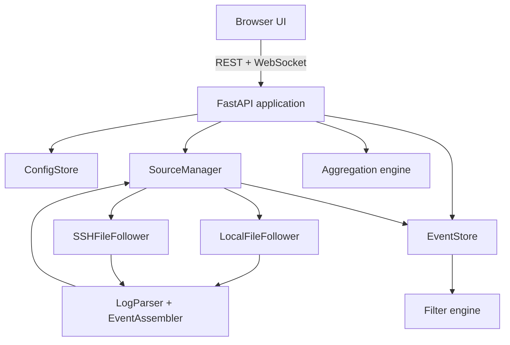
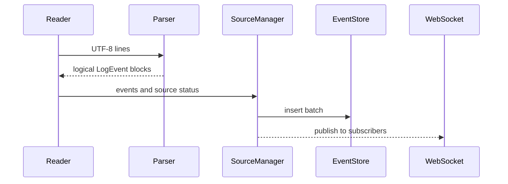

# Architecture

## Components



## Dependency and connectivity map

| Component | Direct dependencies | Called by / output | Persistent effect |
|---|---|---|---|
| `cli.py` | `argparse`, `uvicorn`, `api.create_app` | console entry point | diagnostic application log |
| `api.py` | config, manager, storage, filters, aggregation, models | REST, WebSocket, static UI | delegates config changes |
| `config.py` | `AppConfig`, JSON, atomic filesystem replace | API and manager | `config.json`, mode `0600` |
| `models.py` | Pydantic | every backend layer and API schema | none |
| `manager.py` | config, storage, local/SSH readers | API lifecycle and WebSocket subscription | none |
| `readers.py` | parser, source/status models, Paramiko for SSH | manager tasks | read-only access to source logs |
| `parser.py` | parser config and event models | both reader implementations | none |
| `storage.py` | SQLite/WAL, filters | manager writes; API queries | session-only cache |
| `filters.py` | filter/event models, regex and datetime parsing | storage query and saved-filter validation | none |
| `aggregation.py` | event model | aggregation endpoint | none |
| `static/app.js` | REST and WebSocket contracts | browser DOM | workspace/source configuration through API |

## Runtime flows

### Ingestion



### Query and display

The UI posts source IDs and a filter tree to `/api/query`. `EventStore` scans the
newest rows in deterministic pages, evaluates the filter tree, returns up to the
requested number of matching events, and sorts the result chronologically. New
events then arrive over one shared WebSocket and are inserted into each active
panel in stable order.

### Source reconfiguration

Metadata-only changes such as name and color do not restart a reader. Changes to
the path, parser, SSH connection, time shift, history depth, or polling interval
stop the old task before cache adjustment and restart. The cache tail that will
be reread is removed first, preventing duplicate events while preserving older
session history.

## Design decisions

### Single read stream per source

`SourceManager` creates at most one reader task for each source. Multiple panels consume the same parsed events, preventing duplicated file and SSH I/O.

### Temporary SQLite buffer

SQLite provides an indexed disk-backed working set without introducing a separate database service. The database uses WAL mode and stores only the current session. A logical-byte counter enforces the configured limit; oldest events are evicted in batches when the limit is exceeded.

### Stable event ordering

Events use the adjusted display timestamp, then reception time, source sequence, and event ID. The WebSocket endpoint buffers events for the configured sorting delay before emission. Late events are inserted at the correct position in each browser panel without forcing the user's scroll position to jump.

### Parsing

The parser supports automatic text/JSON detection, common ISO-like timestamps, syslog month timestamps, custom regex/format pairs, level extraction, and nested JSON timestamp/level fields. `EventAssembler` combines continuation lines with the preceding timestamped line.

### Source state machine

```text
starting → running
starting/running → missing
starting/running → error
missing/error → running
any active state → stopped
SSH additionally uses connecting before running/error
```

Source failures are isolated. They update UI state and trigger retry rather than terminating the process.

### Security boundaries

- Default bind address is `127.0.0.1`.
- Configuration and cache permissions are user-private.
- SSH uses system host keys and rejects unknown keys.
- SSH passwords/passphrases are not persisted or accepted by the configuration model.
- Source files are opened read-only.
- Diagnostics omit event contents and secrets.

## Data model

A source contains path/SSH location, parser settings, color, history count, poll interval, and time shift. Sources are global and can be referenced by any workspace.

A workspace stores grid columns and panels. A panel stores one or more source IDs, a filter tree, display settings, and aggregation mode.

Persistent configuration stores only metadata. `LogEvent` records exist solely in the current SQLite session and browser memory.

## Extension points

- Add another reader by implementing the reader protocol and registering it in `SourceManager`.
- Add timestamp formats in `parser.py` without changing storage.
- Add filters by extending `FilterCondition` and `matches_condition`.
- Add aggregations in `aggregation.py` and expose them through the existing endpoint.
